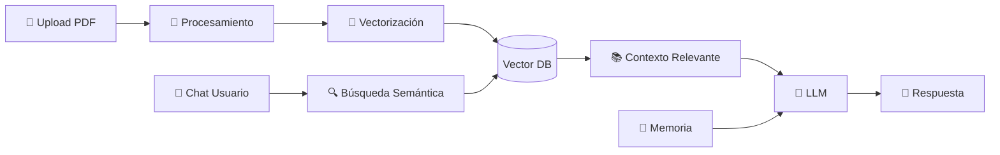

# Sistema RAG con Chat para Documentos Médicos

## 📋 Descripción General

Este documento detalla la arquitectura y los requerimientos técnicos para implementar un sistema **RAG (Retrieval-Augmented Generation)** con interfaz de chat, diseñado específicamente para procesar y consultar **legajos médicos** en formato PDF.

### Flujo de Funcionamiento



---

## 🏗️ Arquitectura del Sistema

### Componentes Principales

| Componente | Descripción | Tecnología |
|------------|-------------|------------|
| **Frontend** | Interfaz de usuario (upload + chat) | Next.js + React |
| **Backend API** | Procesamiento y orquestación | Next.js API Routes |
| **Procesador PDF** | Extracción de texto de PDFs | **pdf-parse** |
| **Embeddings** | Vectorización de texto | **Gemini** (`gemini-embedding-001`) |
| **Vector Database** | Almacenamiento de embeddings | **Supabase pgvector** |
| **LLM** | Generación de respuestas | **Gemini** (`gemini-3-flash-preview`) |
| **Memoria** | Historial de conversación | **Supabase** |

---

## 📦 Stack Tecnológico

### Dependencias (Next.js + TypeScript)

```json
{
  "dependencies": {
    "@google/generative-ai": "^0.21.x",
    "@supabase/supabase-js": "^2.x",
    "pdf-parse": "^1.1.1",
    "ai": "^3.x"
  },
  "devDependencies": {
    "@types/pdf-parse": "^1.1.x"
  }
}
```

### Variables de Entorno

```env
# Gemini API
GEMINI_API_KEY=tu_api_key_de_gemini

# Supabase
NEXT_PUBLIC_SUPABASE_URL=https://tu-proyecto.supabase.co
NEXT_PUBLIC_SUPABASE_ANON_KEY=tu_anon_key
SUPABASE_SERVICE_ROLE_KEY=tu_service_role_key
```

---

## 📄 Procesamiento de Documentos PDF

### Consideraciones para Legajos Médicos (~45 páginas)

> [!IMPORTANT]
> Los documentos médicos pueden contener:
> - Texto estructurado (tablas de laboratorio)
> - Texto no estructurado (notas del médico)
> - Imágenes (radiografías, estudios)
> - Formularios escaneados

### Estrategia de Chunking

```typescript
interface ChunkingConfig {
  chunkSize: number;      // 1000-1500 caracteres recomendado
  chunkOverlap: number;   // 200-300 caracteres (20% del chunk)
  separator: string[];    // ["\n\n", "\n", " "]
}

const medicalChunkConfig: ChunkingConfig = {
  chunkSize: 1200,
  chunkOverlap: 250,
  separator: ["\n\n", "\n", ". "]
};
```

### Proceso de Extracción con pdf-parse

```typescript
import pdfParse from "pdf-parse";

interface ProcessedChunk {
  content: string;
  pageNumber: number;
  chunkIndex: number;
  metadata: {
    documentType: string;
    processedAt: string;
  };
}

async function processDocument(pdfBuffer: Buffer): Promise<ProcessedChunk[]> {
  // 1. Extraer texto del PDF
  const pdfData = await pdfParse(pdfBuffer);
  const fullText = pdfData.text;
  
  // 2. Dividir en chunks
  const chunks = splitIntoChunks(fullText, {
    chunkSize: 1200,
    chunkOverlap: 250
  });
  
  // 3. Añadir metadata
  return chunks.map((content, index) => ({
    content,
    pageNumber: Math.floor(index / 3) + 1, // Estimación
    chunkIndex: index,
    metadata: {
      documentType: "medical_record",
      processedAt: new Date().toISOString()
    }
  }));
}

// Función de chunking manual
function splitIntoChunks(
  text: string, 
  config: { chunkSize: number; chunkOverlap: number }
): string[] {
  const { chunkSize, chunkOverlap } = config;
  const chunks: string[] = [];
  
  // Dividir por párrafos primero
  const paragraphs = text.split(/\n\n+/);
  let currentChunk = "";
  
  for (const paragraph of paragraphs) {
    if ((currentChunk + paragraph).length > chunkSize) {
      if (currentChunk) {
        chunks.push(currentChunk.trim());
        // Mantener overlap
        currentChunk = currentChunk.slice(-chunkOverlap) + paragraph;
      } else {
        // Párrafo muy largo, dividir por oraciones
        chunks.push(paragraph.slice(0, chunkSize));
        currentChunk = paragraph.slice(chunkSize - chunkOverlap);
      }
    } else {
      currentChunk += (currentChunk ? "\n\n" : "") + paragraph;
    }
  }
  
  if (currentChunk.trim()) {
    chunks.push(currentChunk.trim());
  }
  
  return chunks;
}
```

---

## 🔢 Vectorización (Embeddings) - Gemini

### Modelo: `gemini-embedding-001`

> [!TIP]
> Gemini Embeddings ofrece dimensiones flexibles (128-3072) y task types específicos para optimizar la calidad de los embeddings según el caso de uso.

| Característica | Valor |
|----------------|-------|
| **Modelo** | `gemini-embedding-001` |
| **Dimensiones** | Configurables: 768, 1536, 3072 (default) |
| **Límite de tokens** | 2,048 tokens por request |
| **Tipo de entrada** | Texto |
| **Costo** | Gratuito en tier básico / Pay-as-you-go |

### Task Types para RAG

Gemini permite especificar el tipo de tarea para mejorar la calidad de los embeddings:

| Task Type | Uso | Descripción |
|-----------|-----|-------------|
| `RETRIEVAL_DOCUMENT` | **Indexar chunks** | Para vectorizar documentos/chunks a almacenar |
| `RETRIEVAL_QUERY` | **Buscar** | Para vectorizar la consulta del usuario |
| `QUESTION_ANSWERING` | **Q&A** | Optimizado para preguntas y respuestas |
| `SEMANTIC_SIMILARITY` | **Comparación** | Para comparar similitud entre textos |

### Cálculo para 45 páginas

```
Estimación:
- 45 páginas × ~500 palabras/página = 22,500 palabras
- ~30,000 tokens aproximadamente
- Chunks resultantes: ~25-35 chunks

Costo aproximado (Gemini API):
- Free tier: 1,500 requests/día GRATIS
- Pay-as-you-go: Precio competitivo vs OpenAI
```

### Implementación con Google Generative AI SDK

```typescript
import { GoogleGenerativeAI } from "@google/generative-ai";

const genAI = new GoogleGenerativeAI(process.env.GEMINI_API_KEY!);

// Modelo de embeddings
const embeddingModel = genAI.getGenerativeModel({ 
  model: "gemini-embedding-001" 
});

// Vectorizar documentos (para indexar)
async function embedDocuments(texts: string[]): Promise<number[][]> {
  const embeddings: number[][] = [];
  
  for (const text of texts) {
    const result = await embeddingModel.embedContent({
      content: { parts: [{ text }] },
      taskType: "RETRIEVAL_DOCUMENT",
      outputDimensionality: 768  // 768, 1536, o 3072
    });
    embeddings.push(result.embedding.values);
  }
  
  return embeddings;
}

// Vectorizar query (para búsqueda)
async function embedQuery(query: string): Promise<number[]> {
  const result = await embeddingModel.embedContent({
    content: { parts: [{ text: query }] },
    taskType: "RETRIEVAL_QUERY",
    outputDimensionality: 768
  });
  
  return result.embedding.values;
}
```

### Procesamiento por Lotes (Batch)

```typescript
// Embeddings en batch para mejor rendimiento
async function embedBatch(texts: string[]): Promise<number[][]> {
  const contents = texts.map(text => ({
    content: { parts: [{ text }] }
  }));
  
  const result = await embeddingModel.batchEmbedContents({
    requests: contents.map(c => ({
      ...c,
      taskType: "RETRIEVAL_DOCUMENT",
      outputDimensionality: 768
    }))
  });
  
  return result.embeddings.map(e => e.values);
}
```

### Configuración de Dimensiones

> [!NOTE]
> Gemini usa **Matryoshka Representation Learning (MRL)**, permitiendo truncar embeddings sin perder calidad significativa.

| Dimensión | Uso Recomendado | Almacenamiento |
|-----------|-----------------|----------------|
| **768** | Balance rendimiento/calidad | ~3KB/vector |
| **1536** | Alta calidad | ~6KB/vector |
| **3072** | Máxima precisión | ~12KB/vector |

**Recomendación para documentos médicos: `768` o `1536` dimensiones.**

---

## 💾 Base de Datos Vectorial

### Opción Recomendada: Supabase con pgvector

```sql
-- Habilitar extensión pgvector
CREATE EXTENSION IF NOT EXISTS vector;

-- Tabla para documentos
CREATE TABLE medical_documents (
  id UUID PRIMARY KEY DEFAULT gen_random_uuid(),
  filename TEXT NOT NULL,
  uploaded_at TIMESTAMP DEFAULT NOW(),
  user_id UUID REFERENCES auth.users(id),
  metadata JSONB
);

-- Tabla para chunks vectorizados
CREATE TABLE document_chunks (
  id UUID PRIMARY KEY DEFAULT gen_random_uuid(),
  document_id UUID REFERENCES medical_documents(id) ON DELETE CASCADE,
  content TEXT NOT NULL,
  embedding VECTOR(768),  -- Usar 768, 1536 o 3072 según configuración de Gemini
  page_number INTEGER,
  chunk_index INTEGER,
  metadata JSONB,
  created_at TIMESTAMP DEFAULT NOW()
);

-- Índice para búsqueda eficiente
CREATE INDEX ON document_chunks 
USING ivfflat (embedding vector_cosine_ops)
WITH (lists = 100);

-- Función de búsqueda semántica
CREATE OR REPLACE FUNCTION match_documents(
  query_embedding VECTOR(768),  -- Debe coincidir con outputDimensionality
  match_threshold FLOAT DEFAULT 0.7,
  match_count INT DEFAULT 5,
  filter_document_id UUID DEFAULT NULL
)
RETURNS TABLE (
  id UUID,
  content TEXT,
  similarity FLOAT,
  metadata JSONB
)
LANGUAGE plpgsql
AS $$
BEGIN
  RETURN QUERY
  SELECT
    dc.id,
    dc.content,
    1 - (dc.embedding <=> query_embedding) AS similarity,
    dc.metadata
  FROM document_chunks dc
  WHERE 
    (filter_document_id IS NULL OR dc.document_id = filter_document_id)
    AND 1 - (dc.embedding <=> query_embedding) > match_threshold
  ORDER BY dc.embedding <=> query_embedding
  LIMIT match_count;
END;
$$;
```

---

## 🔍 Sistema de Recuperación (Retrieval)

### Búsqueda Híbrida Recomendada

```typescript
interface RetrievalConfig {
  semanticWeight: number;  // 0.7 - Búsqueda por similitud
  keywordWeight: number;   // 0.3 - Búsqueda por palabras clave
  topK: number;            // 5-10 chunks más relevantes
  threshold: number;       // 0.7 similitud mínima
}

async function hybridSearch(
  query: string,
  documentId: string,
  config: RetrievalConfig
): Promise<RetrievedChunk[]> {
  // 1. Vectorizar query
  const queryEmbedding = await embeddings.embedQuery(query);
  
  // 2. Búsqueda semántica
  const semanticResults = await supabase.rpc("match_documents", {
    query_embedding: queryEmbedding,
    match_threshold: config.threshold,
    match_count: config.topK,
    filter_document_id: documentId
  });
  
  // 3. Combinar y rankear resultados
  return semanticResults.data;
}
```

---

## 🧠 Memoria de Conversación (Supabase)

### Tablas para Persistir Memoria

```sql
CREATE TABLE chat_sessions (
  id UUID PRIMARY KEY DEFAULT gen_random_uuid(),
  document_id UUID REFERENCES medical_documents(id) ON DELETE CASCADE,
  user_id UUID REFERENCES auth.users(id),
  title TEXT,
  created_at TIMESTAMP DEFAULT NOW(),
  updated_at TIMESTAMP DEFAULT NOW()
);

CREATE TABLE chat_messages (
  id UUID PRIMARY KEY DEFAULT gen_random_uuid(),
  session_id UUID REFERENCES chat_sessions(id) ON DELETE CASCADE,
  role TEXT CHECK (role IN ('user', 'assistant', 'system')) NOT NULL,
  content TEXT NOT NULL,
  metadata JSONB,
  created_at TIMESTAMP DEFAULT NOW()
);

-- Índice para recuperar historial rápidamente
CREATE INDEX idx_messages_session ON chat_messages(session_id, created_at);

-- Trigger para actualizar updated_at
CREATE OR REPLACE FUNCTION update_updated_at()
RETURNS TRIGGER AS $$
BEGIN
  NEW.updated_at = NOW();
  RETURN NEW;
END;
$$ LANGUAGE plpgsql;

CREATE TRIGGER trigger_update_session
BEFORE UPDATE ON chat_sessions
FOR EACH ROW EXECUTE FUNCTION update_updated_at();
```

### Funciones de Memoria en TypeScript

```typescript
import { createClient } from "@supabase/supabase-js";

const supabase = createClient(
  process.env.NEXT_PUBLIC_SUPABASE_URL!,
  process.env.SUPABASE_SERVICE_ROLE_KEY!
);

interface ChatMessage {
  id: string;
  role: "user" | "assistant";
  content: string;
  created_at: string;
}

// Crear nueva sesión de chat
async function createChatSession(
  documentId: string, 
  userId: string
): Promise<string> {
  const { data, error } = await supabase
    .from("chat_sessions")
    .insert({ document_id: documentId, user_id: userId })
    .select("id")
    .single();
  
  if (error) throw error;
  return data.id;
}

// Obtener historial de chat (últimos N mensajes)
async function getChatHistory(
  sessionId: string, 
  limit: number = 10
): Promise<ChatMessage[]> {
  const { data, error } = await supabase
    .from("chat_messages")
    .select("id, role, content, created_at")
    .eq("session_id", sessionId)
    .order("created_at", { ascending: true })
    .limit(limit);
  
  if (error) throw error;
  return data || [];
}

// Guardar mensaje en el historial
async function saveChatMessage(
  sessionId: string,
  role: "user" | "assistant",
  content: string
): Promise<void> {
  const { error } = await supabase
    .from("chat_messages")
    .insert({ session_id: sessionId, role, content });
  
  if (error) throw error;
}

// Formatear historial para el prompt
function formatChatHistory(messages: ChatMessage[]): string {
  return messages
    .map(msg => `${msg.role === "user" ? "Usuario" : "Asistente"}: ${msg.content}`)
    .join("\n");
}
```

### Estrategia de Ventana Deslizante

> [!NOTE]
> Para conversaciones largas, usa una ventana de los últimos **10-15 mensajes** para mantener contexto sin exceder límites de tokens.

```typescript
// Obtener contexto optimizado
async function getOptimizedHistory(sessionId: string): Promise<string> {
  // Últimos 10 mensajes para contexto inmediato
  const recentMessages = await getChatHistory(sessionId, 10);
  
  return formatChatHistory(recentMessages);
}
```

---

## 🤖 Generación de Respuestas (Gemini LLM)

### Configuración del Modelo Gemini

```typescript
import { GoogleGenerativeAI } from "@google/generative-ai";

const genAI = new GoogleGenerativeAI(process.env.GEMINI_API_KEY!);

// Modelo para chat
const chatModel = genAI.getGenerativeModel({ 
  model: "gemini-3-flash-preview",
  generationConfig: {
    temperature: 0.3,      // Bajo para respuestas consistentes
    topP: 0.8,
    topK: 40,
    maxOutputTokens: 2048
  }
});
```

### Prompt Template para Asistente Médico

```typescript
const MEDICAL_ASSISTANT_PROMPT = `
Eres un asistente médico especializado en analizar legajos médicos.
Tu rol es ayudar a interpretar y responder preguntas sobre el documento médico proporcionado.

## Directrices:
1. Basa TODAS tus respuestas en el contexto del documento proporcionado
2. Si la información no está en el documento, indica claramente que no está disponible
3. Usa terminología médica apropiada pero explica términos complejos
4. NO inventes información médica
5. Siempre recomienda consultar con un profesional de salud para decisiones médicas

## Contexto del Documento:
{context}

## Historial de Conversación:
{chat_history}

## Pregunta del Usuario:
{question}

## Tu Respuesta:
`;
```

### Función de Generación con Gemini

```typescript
async function generateResponse(
  context: string,
  chatHistory: string,
  question: string
): Promise<string> {
  const prompt = MEDICAL_ASSISTANT_PROMPT
    .replace("{context}", context)
    .replace("{chat_history}", chatHistory)
    .replace("{question}", question);
  
  const result = await chatModel.generateContent(prompt);
  const response = result.response;
  
  return response.text();
}

// Versión con streaming
async function* generateResponseStream(
  context: string,
  chatHistory: string,
  question: string
): AsyncGenerator<string> {
  const prompt = MEDICAL_ASSISTANT_PROMPT
    .replace("{context}", context)
    .replace("{chat_history}", chatHistory)
    .replace("{question}", question);
  
  const result = await chatModel.generateContentStream(prompt);
  
  for await (const chunk of result.stream) {
    yield chunk.text();
  }
}
```

---

## 🔄 Flujo Completo de Chat

```typescript
async function processChat(
  userMessage: string,
  documentId: string,
  sessionId: string
): Promise<string> {
  // 1. Recuperar historial de conversación
  const chatHistory = await getChatHistory(sessionId, 10);
  
  // 2. Buscar contexto relevante en el documento
  const relevantChunks = await hybridSearch(userMessage, documentId, {
    semanticWeight: 0.7,
    keywordWeight: 0.3,
    topK: 5,
    threshold: 0.7
  });
  
  // 3. Construir contexto
  const context = relevantChunks
    .map(chunk => chunk.content)
    .join("\n\n---\n\n");
  
  // 4. Formatear historial
  const historyText = chatHistory
    .map(msg => `${msg.role}: ${msg.content}`)
    .join("\n");
  
  // 5. Generar respuesta
  const prompt = MEDICAL_ASSISTANT_PROMPT
    .replace("{context}", context)
    .replace("{chat_history}", historyText)
    .replace("{question}", userMessage);
  
  const response = await llm.invoke(prompt);
  
  // 6. Guardar en historial
  await saveChatMessage(sessionId, "user", userMessage);
  await saveChatMessage(sessionId, "assistant", response.content);
  
  return response.content;
}
```

---

## 📐 API Routes para Next.js

### Estructura de Endpoints

```
/api
├── /documents
│   ├── POST /upload          # Subir y procesar PDF
│   ├── GET /:id              # Obtener documento
│   └── DELETE /:id           # Eliminar documento
├── /chat
│   ├── POST /message         # Enviar mensaje
│   ├── GET /sessions/:docId  # Listar sesiones
│   └── GET /history/:sessId  # Obtener historial
└── /embeddings
    └── POST /search          # Búsqueda semántica
```

### Ejemplo: Endpoint de Chat con Gemini

```typescript
// app/api/chat/message/route.ts
import { NextRequest, NextResponse } from "next/server";
import { GoogleGenerativeAI } from "@google/generative-ai";
import { createClient } from "@supabase/supabase-js";

const genAI = new GoogleGenerativeAI(process.env.GEMINI_API_KEY!);
const supabase = createClient(
  process.env.NEXT_PUBLIC_SUPABASE_URL!,
  process.env.SUPABASE_SERVICE_ROLE_KEY!
);

export async function POST(req: NextRequest) {
  const { message, documentId, sessionId } = await req.json();
  
  if (!message || !documentId) {
    return NextResponse.json(
      { error: "Message and documentId are required" },
      { status: 400 }
    );
  }
  
  try {
    // 1. Obtener historial
    const history = await getChatHistory(sessionId, 10);
    
    // 2. Buscar contexto relevante
    const chunks = await searchRelevantChunks(message, documentId);
    
    // 3. Generar respuesta con Gemini
    const response = await generateResponse(
      chunks.map(c => c.content).join("\n\n"),
      formatChatHistory(history),
      message
    );
    
    // 4. Guardar mensajes
    await saveChatMessage(sessionId, "user", message);
    await saveChatMessage(sessionId, "assistant", response);
    
    return NextResponse.json({ response });
  } catch (error) {
    console.error("Chat error:", error);
    return NextResponse.json(
      { error: "Failed to process message" },
      { status: 500 }
    );
  }
}
```

---

## 🔒 Consideraciones de Seguridad

> [!CAUTION]
> Los documentos médicos contienen **información sensible (PHI)**. Implementa estas medidas:

### Checklist de Seguridad

- [ ] **Encriptación en tránsito**: HTTPS obligatorio
- [ ] **Encriptación en reposo**: Encriptar PDFs almacenados
- [ ] **Control de acceso**: RLS (Row Level Security) en Supabase
- [ ] **Autenticación**: JWT con expiración corta
- [ ] **Auditoría**: Logs de acceso a documentos
- [ ] **Anonimización**: Opción para ocultar datos sensibles
- [ ] **Retención de datos**: Política de eliminación automática

### Row Level Security (RLS)

```sql
-- Habilitar RLS
ALTER TABLE medical_documents ENABLE ROW LEVEL SECURITY;
ALTER TABLE document_chunks ENABLE ROW LEVEL SECURITY;
ALTER TABLE chat_sessions ENABLE ROW LEVEL SECURITY;
ALTER TABLE chat_messages ENABLE ROW LEVEL SECURITY;

-- Políticas de acceso
CREATE POLICY "Users can view own documents"
ON medical_documents FOR SELECT
USING (auth.uid() = user_id);

CREATE POLICY "Users can insert own documents"
ON medical_documents FOR INSERT
WITH CHECK (auth.uid() = user_id);
```

---

## ⚡ Optimizaciones de Rendimiento

### Para Documentos de 45 Páginas

| Optimización | Descripción | Impacto |
|--------------|-------------|---------|
| **Procesamiento async** | Procesar PDF en background job | UX mejorada |
| **Caching de embeddings** | No re-vectorizar documentos | Ahorro de costos |
| **Streaming responses** | Respuestas en tiempo real | UX mejorada |
| **Índices optimizados** | IVFFlat para pgvector | Búsqueda rápida |
| **Rate limiting** | Limitar requests por usuario | Protección de costos |

### Ejemplo: Background Processing

```typescript
// Usar queue para procesamiento
import { Queue } from "bullmq";

const documentQueue = new Queue("document-processing", {
  connection: {
    host: process.env.REDIS_HOST,
    port: parseInt(process.env.REDIS_PORT || "6379")
  }
});

// Añadir trabajo a la cola
await documentQueue.add("process-pdf", {
  documentId,
  filePath,
  userId
});
```

---

## 📊 Estimación de Costos

### Por Documento (45 páginas)

| Servicio | Costo Estimado |
|----------|----------------|
| Embeddings (Gemini) | **GRATIS** (Free tier) |
| Almacenamiento (Supabase) | $0.001/mes |
| LLM (Gemini Pro) | $0.001-0.01/consulta |
| **Total por documento** | **~$0.01/día uso activo** |

### Mensual (100 documentos, 500 consultas/doc)

```
Embeddings: GRATIS (hasta 1,500 requests/día)
Storage: 100 × $0.001 = $0.10
LLM (Gemini Pro): 50,000 consultas × $0.005 = $250

Estimado mensual: ~$250-400
```

> [!TIP]
> Usando Gemini tanto para embeddings como para LLM reduces significativamente los costos comparado con OpenAI.

---

## 🚀 Pasos de Implementación

### Fase 1: Fundamentos (Semana 1)
- [ ] Configurar proyecto Next.js
- [ ] Integrar Supabase (auth + database)
- [ ] Crear tablas y funciones SQL
- [ ] Implementar upload de PDF

### Fase 2: RAG Core (Semana 2)
- [ ] Integrar procesamiento de PDF
- [ ] Implementar chunking y embeddings
- [ ] Configurar búsqueda vectorial
- [ ] Crear endpoint de búsqueda

### Fase 3: Chat (Semana 3)
- [ ] Implementar interfaz de chat
- [ ] Integrar LLM con streaming
- [ ] Añadir memoria de conversación
- [ ] Persistir historial

### Fase 4: Optimización (Semana 4)
- [ ] Implementar background processing
- [ ] Añadir caching
- [ ] Configurar seguridad (RLS)
- [ ] Testing y ajustes de prompts

---

## 📚 Recursos Adicionales

- [Gemini Embeddings Documentation](https://ai.google.dev/gemini-api/docs/embeddings)
- [Google Generative AI SDK](https://github.com/google/generative-ai-js)
- [LangChain.js Documentation](https://js.langchain.com/)
- [Supabase Vector Guide](https://supabase.com/docs/guides/ai)
- [Vercel AI SDK](https://sdk.vercel.ai/docs)
- [Gemini API Cookbook](https://github.com/google-gemini/cookbook)

---

> [!NOTE]
> Este documento sirve como guía de referencia. La implementación específica puede variar según los requerimientos del proyecto y las decisiones de arquitectura tomadas durante el desarrollo.
